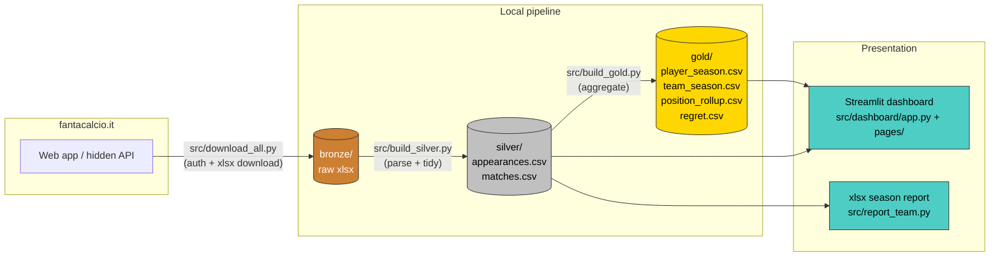
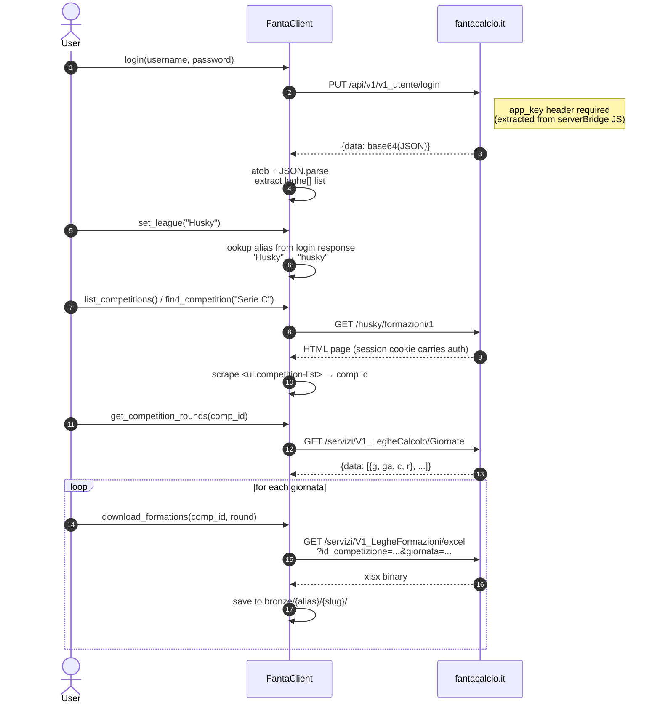

# Architecture

This document describes Fanalysista's data flow, the reverse-engineered fantacalcio.it endpoints, and the on-disk schema. It's the reference doc when adding new analyses or pages.

## Table of contents

- [Data pipeline (bronze → silver → gold → presentation)](#data-pipeline)
- [Download flow](#download-flow)
- [Module dependencies](#module-dependencies)
- [Why a medallion layout?](#why-medallion)
- [Schema reference](#schema-reference)
- [Reverse-engineered endpoints](#reverse-engineered-endpoints)
- [Extending the project](#extending-the-project)

## Data pipeline



Each layer is independently consumable — the dashboard reads from `gold/` (with `silver/` as a supporting source for match-level views), so you can run analyses without re-downloading anything.

## Download flow



## Module dependencies

```mermaid
flowchart TD
    subgraph shared["src/ — shared modules"]
        cli[cli.py<br/>argparse + folder resolver]
        fc[fanta_client.py<br/>HTTP client + login]
        pf[parse_formations.py<br/>xlsx → Match records]
    end

    subgraph scripts["src/ — pipeline scripts"]
        do[download_one.py]
        da[download_all.py]
        bs[build_silver.py]
        bg[build_gold.py]
        rt[report_team.py]
    end

    subgraph dash["src/dashboard/"]
        ddata[data.py<br/>cached loaders + sidebar selector]
        dtheme[theme.py<br/>shared colour palette]
        dmodals[modals.py<br/>@st.dialog team / player summaries]
        dapp[app.py]
        dpages["pages/<br/>1_League_Table<br/>2_Team_Detail<br/>3_Player_Detail<br/>4_Players<br/>5_Regret"]
    end

    do --> cli
    do --> fc
    da --> cli
    da --> fc
    bs --> cli
    bs --> pf
    bg --> cli
    rt --> cli

    dapp --> ddata
    dpages --> ddata
```

## Why medallion

Three benefits from the bronze/silver/gold split:

1. **Independence**: Each layer can be rebuilt without re-running the previous one. Once bronze is on disk, silver and gold are pure transforms with no network or credential need.
2. **Forkability**: The silver CSVs are tidy, long-format facts (one row per player-giornata, one row per team-match). Any downstream consumer — a notebook, a different BI tool, a SQL engine — can join them however it wants without you having to anticipate every analysis at parse time.
3. **Cheap analyses**: Adding a new gold table is usually 20-40 lines of pandas reading silver. The dashboard then picks it up automatically once you add a loader and a page.

## Schema reference

### Bronze

```
data/bronze/{league_alias}/{competition_slug}/Formazioni_{alias}_{N}_giornata.xlsx
```

Raw downloads — one xlsx per giornata. Filename comes from the server's `Content-Disposition`. Multiple matches per file (left team in cols A–E, right team in cols G–K). See [src/parse_formations.py](../src/parse_formations.py) for the block layout.

### Silver — `appearances.csv`

One row per (player, giornata, team).

| Column | Type | Notes |
|---|---|---|
| `giornata` | int | 1..N |
| `team` | str | uppercase team name as printed by the site |
| `player` | str | trailing `*` (left-the-pool marker) is stripped |
| `position` | str | `P` / `D` / `C` / `A` |
| `voto` | float? | the underlying Serie A vote; `null` if `-` or missing |
| `fantavoto` | float? | voto + bonuses (the value that actually counts) |
| `active` | bool | `True` if this player counted toward the team's TOTALE that giornata |
| `on_bench` | bool | `True` if they were listed under "Panchina" |

### Silver — `matches.csv`

One row per (team, giornata). Each match contributes two rows (one for each team's POV).

| Column | Type | Notes |
|---|---|---|
| `giornata` | int | |
| `team` | str | this row's POV |
| `opponent` | str | the other side |
| `side` | str | `left` or `right` — `left` is the home team (gets `fattore_campo`) |
| `score_for` / `score_against` | int | match score |
| `result` | str | `W` / `D` / `L` |
| `totale` | float | final TOTALE for this team |
| `module` | int | formation as printed (e.g. `343`, `442`) |
| `modificatore_difesa` | float? | defensive bonus, if any |
| `fattore_campo` | float? | home-advantage bonus (only on `side==left`) |

### Gold — `player_season.csv`

One row per (team, player).

| Column | Meaning |
|---|---|
| `team`, `player`, `position` | identity (position = first-seen, never changes mid-season) |
| `apps_in_squad` | giornate where the player appeared in the team's 25 |
| `apps_with_voto` | of those, how many had a real voto (not `-`) |
| `apps_active` | of those, how many counted toward TOTALE |
| `apps_missed` | inactive appearances **where they had a voto** (the player you didn't use) |
| `pct_active_rate` | `apps_active / apps_in_squad` |
| `pct_fv_captured` | `total_active_fv / (total_active_fv + total_fv_missed)` |
| `total_voto`, `total_fv` | season raw performance (every appearance) |
| `total_active_fv` | season contribution to TOTALE |
| `total_fv_missed` | season fv left on the bench |
| `avg_active_fv`, `avg_fv_missed` | per-game averages of the two |
| `best_active_fv`, `worst_active_fv` | extremes of active appearances |

### Gold — `team_season.csv`

The league table. One row per team.

| Column | Meaning |
|---|---|
| `team`, `matches_played` | identity |
| `wins`, `draws`, `losses`, `points` | record (`points = 3W + D`) |
| `goals_for`, `goals_against`, `goal_diff` | match scores |
| `totale_{sum,avg,max,min}` | season TOTALE statistics |
| `totale_max_g`, `totale_max_vs` | which giornata + opponent gave the best score |
| `totale_min_g`, `totale_min_vs` | same for the worst |
| `opp_totale_avg` | average TOTALE allowed |
| `totale_diff_avg` | average margin of victory/defeat |
| `fattore_campo_count` | how many home games |
| `modificatore_difesa_sum` | season-total defence bonus |
| `regret_total`, `regret_avg`, `regret_max`, `regret_max_g` | from `regret.csv` |
| `perfect_giornate` | giornate where actual lineup == optimal |

### Gold — `position_rollup.csv`

One row per (team, position).

| Column | Meaning |
|---|---|
| `players_used` | unique players who ever played that position for the team |
| `apps_active`, `apps_missed` | aggregated across all players in that position |
| `total_active_fv`, `total_fv_missed` | aggregated |
| `avg_active_fv` | per-appearance average |
| `pct_fv_captured` | position-level capture rate |

### Gold — `regret.csv`

One row per (team, giornata). The "what's the best lineup you could have picked from your 25?" view.

| Column | Meaning |
|---|---|
| `actual_module` | what the manager played (e.g. `343`) |
| `actual_player_fv` | sum of fantavoto for the 11 active players (TOTALE minus bonuses) |
| `optimal_module` | best module given the 25-player squad |
| `optimal_player_fv` | best achievable sum from any valid module |
| `regret` | `optimal_player_fv − actual_player_fv` |
| `module_matched` | `True` if the manager already picked the optimal module |

The optimal calculation is constrained to:

- The 25 players the manager actually submitted that giornata (no roster-level "what if you'd bought this player" analysis).
- The set of valid modules: `343, 352, 433, 442, 451, 532, 541` — change `VALID_MODULES` in `src/build_gold.py` if your league allows others.
- Bonuses (Modificatore difesa, Fattore campo) are excluded from both sides since they would apply approximately equally and would muddy the comparison.

## Reverse-engineered endpoints

All endpoints live under `https://leghe.fantacalcio.it/`. The site exposes them through bundled JavaScript (`web/js/utils/api.js`, `web/js/league/league_formations.js`) but does not document them publicly.

| Method | Path | Purpose | Notes |
|---|---|---|---|
| `PUT` | `/api/v1/v1_utente/login?alias_lega={alias}` | Authenticate | Body: `{"username":..., "password":...}`. Response wrapped as `{data: base64(JSON)}`. The decoded JSON contains the user's leagues, each with their `alias` and a per-league JWT. Session cookie is what's used for subsequent requests, not the JWT. |
| `GET` | `/{league_alias}/formazioni/1` | Load the formations page | Used to scrape the competition dropdown (`<ul class="competition-list"><li><a data-id="...">Competition Name</a></li></ul>`). |
| `GET` | `/servizi/V1_LegheCalcolo/Giornate?alias_lega={alias}&id_competizione={id}` | List all giornata for a competition | Response: `{data: [{g, ga, c, r}, ...]}`. `g` = giornata number, `r` = result (populated when matches have been played). |
| `GET` | `/servizi/V1_LegheFormazioni/excel?alias_lega=...&id_competizione=...&giornata=...&nome_competizione=...&dummy=5` | Download the formations xlsx | Response: xlsx binary. Filename in `Content-Disposition`. |

All requests need the header `app_key: bZ2FAQDZYYBVEehhFuM9pAsJ3waL0Vsg` — the value comes from the site's `serverBridge` script tag (`__.g('sd').authAppKey`).

### Login response decoding

The site's JS does:

```js
JSON.parse(atob(data).replace('\r\n', '\\r\\n').replace(//, ''))
```

The Python client mirrors this exactly. See `src/fanta_client.py::login`.

### XLSX cell conventions

- Two teams per match block, side by side (left = cols A–E, right = cols G–K). Score in col F as `"X-Y"`.
- Within a block: team name row → module row → 11 starting rows → `Panchina` row → 14 bench rows → optional `Modificatore difesa` / `Fattore campo` rows → `TOTALE: NN,NN` row.
- Inactive (greyed-out) players are encoded as **font color `#FFD3D3D3`** on the player-name cell. This is the only signal — `voto`/`fv` cells of inactive players can still be populated.
- Player names ending in ` *` indicate "left the player pool"; same person as the un-starred name.

## Extending the project

### Adding a new analysis

1. Add a builder function to [src/build_gold.py](../src/build_gold.py) that reads silver and returns a `pd.DataFrame`.
2. Write it out as a new `data/gold/{league}/{comp}/{name}.csv` in `main()`.
3. Add a loader in [src/dashboard/data.py](../src/dashboard/data.py): `@st.cache_data def load_{name}(league, comp): ...`.
4. Add a page in [src/dashboard/pages/](../src/dashboard/pages/), numbered `N_Name.py`.

The page numbering controls the sidebar order — pick a number that fits where the page belongs.

### Adding a new dashboard page

Pages must (a) insert the parent directory into `sys.path`, (b) call `require_data()` from `data.py` to render the shared sidebar selectors, (c) use `width="stretch"` (not the deprecated `use_container_width=True`), and (d) pull colours from `theme.py` rather than hardcoding hex values — that's what keeps the palette consistent across pages.

To support click-to-navigate, write team/player selectors against the shared session-state keys `selected_team` and `selected_player`. Pages that emit navigation (League Table → Team Detail, Players → Player Detail, etc.) set those keys before calling `st.switch_page("pages/N_Target.py")`. Pages that receive navigation use them as default values for their sidebar selectboxes.

A minimal template (for a page at `src/dashboard/pages/N_My_Page.py`):

```python
import sys
from pathlib import Path
sys.path.insert(0, str(Path(__file__).resolve().parent.parent))

import streamlit as st
from data import load_player_season, require_data

st.set_page_config(page_title="My Page", layout="wide")
st.title("My Page")
league, comp = require_data()
ps = load_player_season(league, comp)
st.dataframe(ps, width="stretch", hide_index=True)
```

### Supporting a new fantacalcio league type

If your league uses modules outside the seven hardcoded ones, update `VALID_MODULES` in [src/build_gold.py](../src/build_gold.py). If your league has a captain rule (currently absent), you'd add a `captain_bonus` column to silver `appearances.csv` and propagate it through gold.

A `config/` folder is reserved for the eventual move to per-league YAML/TOML rule files (valid modules, scoring tweaks, captain logic) so that supporting a non-standard league doesn't require editing source code.

### Testing

The dashboard has no formal test suite yet (a `tests/` folder is reserved), but Streamlit ships a programmatic test runner that catches exceptions:

```python
from streamlit.testing.v1 import AppTest
at = AppTest.from_file("src/dashboard/app.py").run()
assert not at.exception
```

This is enough to verify a page boots without crashing — useful when refactoring shared loaders. See [ROADMAP.md](ROADMAP.md) for the planned testing direction.
